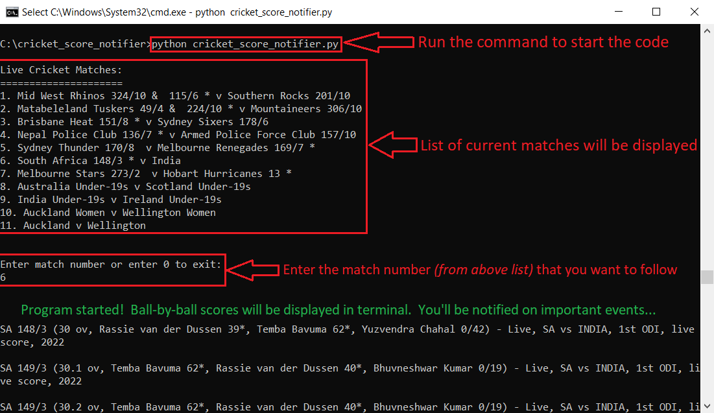
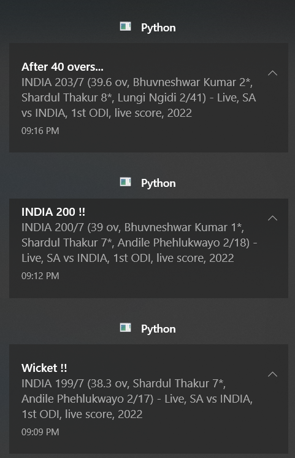

# Live Cricket Score Notifier

## About

Following a live cricket match while working on your computer could be challenging especially if you want to follow every important event like a batsman's milestone or a wicket. This project is designed just to solve this problem. You simply run the python application in the background and continue working on your computer. The python application notifies you based on the notification settings that you have configured.

### Notes

  1. This script was developed and tested only on Windows 10, Python v3.7.9.

  2. The live scores are fetched from http://static.cricinfo.com/rss/livescores.xml. The scores are generally fast and reliable from this source. But sometimes, other sources like cricbuzz might be faster by a ball or two.

### Built With

- [Python 3.7](https://www.python.org/downloads/release/python-379/)
- Python Modules:
  - [beautifulsoup4](https://pypi.org/project/beautifulsoup4/)
  - [plyer](https://pypi.org/project/plyer/)
  - [requests](https://pypi.org/project/requests/)

## Getting Started

### Prerequisites

1. Clone this repository by running the below command in a terminal:

   ```sh
   git clone https://github.com/shriram-m/cricket_score_notifier.git
   cd cricket_score_notifier
   ```

2. Install dependencies:

   ```sh
   pip install -r requirements.txt
   ```

### Usage

After installing the dependencies, all you need to do is to run the following command:

```sh
python cricket_score_notifier.py
```

You will get an interactive prompt where you'll specify the match number that you are interested in.

##### Figure 1. Terminal Output



After that, you can let the terminal run in the background and continue your work. The code will send you notifications on every configured event like after every over, wicket, innings, batsman milestone, batting team milestone, etc. See [Settings](#settings) section to customize your notification settings.

##### Figure 2. Windows 10 Notification Example



#### Settings

1. **Notification Settings**

   You can customize your notification settings by choosing the events that you would be interested in by editing the corresponding variables in the `cricket_score_notifier.py` file.

   | Notification Event                                                               | Python variable                             | Valid values           |
   |----------------------------------------------------------------------------------|---------------------------------------------|------------------------|
   | **Innings**                                                                      | `notify_after_every_inning`                 | `True` / `False`       |
   | **Wicket**                                                                       | `notify_after_every_wicket`                 | `True` / `False`       |
   | **Batsman's milestone**                                                          | `notify_after_every_batsman_milestone`      | `True` / `False`       |
   | **Batting team milestone**                                                       | `notify_after_every_batting_team_milestone` | `True` / `False`       |
   | Every 'x' number of **overs**                                                    | `notify_after_every_x_overs`                | `True` / `False`       |
   | Value x referred above<br>Applicable only if `notify_after_every_x_overs = True` | `x_overs_to_notify`                         | Positive integers only |

2. **Other settings**

   - *Time interval (in seconds) between polling for live scores*: Assign a positive real number to the variable `refresh_interval_sec`

   - *Time duration (in seconds) for which the notification would be displayed*: Assign a positive real number to the variable `notification_display_duration_sec`

## Contributing

First off, thanks for taking the time to contribute! Contributions are what make the open-source community such an amazing place to learn, inspire, and create. Any contributions you make will benefit everybody else and are **greatly appreciated**.

Please try to create bug reports that are:

- _Reproducible._ Include steps to reproduce the problem.
- _Specific._ Include as much detail as possible: which version, what environment, etc.
- _Unique._ Do not duplicate existing opened issues.
- _Scoped to a Single Bug._ One bug per report.

## License

This project is licensed under the **MIT license**. Feel free to edit and distribute this template as you like.

See [LICENSE](LICENSE) for more information.
